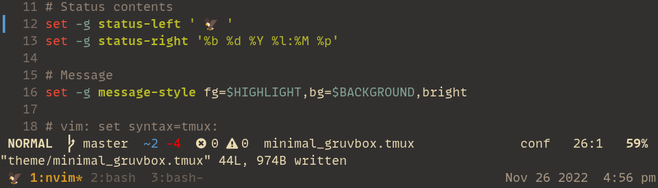

# Minimal Gruvbox Tmux Statusbar

## Install

0. Use [TPM](https://github.com/tmux-plugins/tpm)

1. Add to your `.tmux.conf`

```
set -g @plugin 'kubil6y/minimal_gruvbox'
```

2. Install -> `prefix + I`

3. You can change background colors manually in minimal_gruvbox.tmux, according to your gruvbox contrast level (soft,mid,hard)

```
bg:"#32302f","#282828","#1d2021"
```

## Preview


